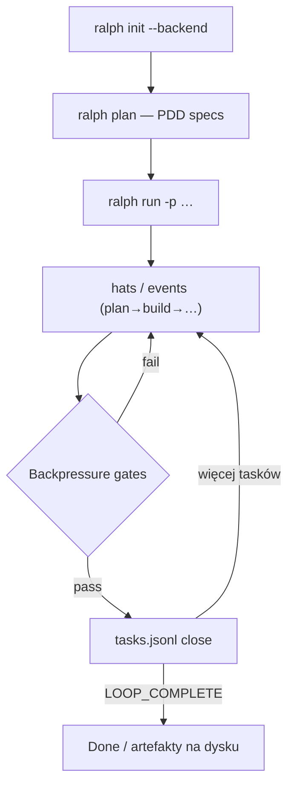

<!-- spine: spine_agent_loop -->
# Ralph Orchestrator

**Repo:** [mikeyobrien/ralph-orchestrator](https://github.com/mikeyobrien/ralph-orchestrator) · ★3132 · Rust (+ TS dashboard) · MIT · CLI `ralph` / npm `@ralph-orchestrator/ralph-cli`

## Co to jest

„Ulepszony Ralph”: hat-based orchestrator, który trzyma agenta w pętli aż `LOOP_COMPLETE` / backlog tasków pusty. Backendy: Claude Code, Kiro, Gemini, Codex, Forge, Amp, Copilot, OpenCode. **Backpressure** = bramki test/lint/typecheck odrzucają niedokończoną pracę. Stan na dysku: `.ralph/agent/memories.md` + `tasks.jsonl`.

## Graf

## Co / gdzie / jak

| Warstwa | Mechanizm |
|---------|-----------|
| **Trigger** | `ralph run -p "…"` lub ścieżka do `.ralph/specs/…` |
| **Stan** | Disk-is-state: memories + tasks; git jako pamięć długoterminowa |
| **Role** | Hats (builder, reviewer, …) + event bus |
| **Sandbox** | Delegowane do backend CLI (nie własny Docker mill) |
| **Testy** | Backpressure: user-defined gates |
| **Merge / PR** | Nie jest ticket-forge out-of-box — pętla kończy się na kodzie/taskach; PR = konwencja repo / backend |
| **Observability** | `ralph web` dashboard (alpha), MCP `ralph mcp serve` |

Warstwa **orkiestracji pętli**, nie pełny label→PR daemon — ale kanon metody Ralph + task runtime.

## Confidence

**88 / 100** — dojrzały CLI (Rust, releases, docs), silny dogfood wzorca; słabszy jako czysty klepacz GH (brak wbudowanego watch-label→PR).

## Linki

- https://github.com/mikeyobrien/ralph-orchestrator
- https://mikeyobrien.github.io/ralph-orchestrator/
- https://ghuntley.com/ralph/
