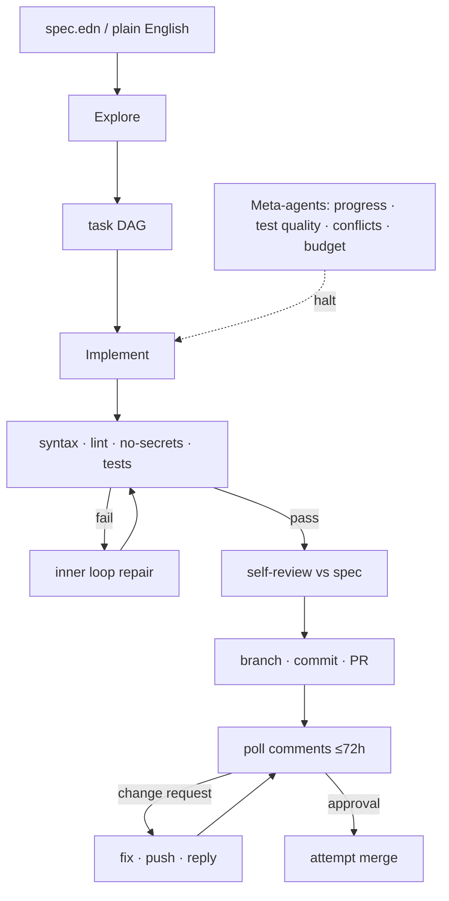

<!-- spine: spine_hybrid -->
# miniforge

**Repo:** [miniforge-ai/miniforge](https://github.com/miniforge-ai/miniforge) · ★42 · Clojure · Apache-2.0

## Co to jest

„Factory, not a chatbot”: piszesz spec (EN lub EDN) → `mf run` → plan DAG → implement → verify → self-review → PR → observe loop (do 72h: komentarze, fixy, merge). Cztery zagnieżdżone pętle + meta-agenci z prawem halt. Dogfood: 530+ PR zmergowanych miniforge na sobie (Clojure).

## Graf

## Co / gdzie / jak

| Warstwa | Mechanizm |
|---------|-----------|
| **Trigger** | CLI `mf run spec.edn` (spec = ticket) |
| **Stan** | Nested control loops + evidence bundles; policy packs |
| **Role** | Team phases + PR monitor + meta coordinator |
| **Sandbox** | Isolated worktrees; budgets (tokens/cost/time) |
| **Testy** | Inner gates obligatoryjne; brak vacuous green |
| **Merge** | Observe loop klasyfikuje review i próbuje merge |
| **Nisza** | Najmocniej dogfoodowany na Clojure; alpha |

Spec→PR z monitorowaniem review = klepacz + post-delivery babysitting zdejmowany z człowieka.

## Confidence

**82 / 100** — mocny dogfood i jasna pętla; alpha, stack Clojure zawęża adopcję poza JVM/Clojure.

## Linki

- https://github.com/miniforge-ai/miniforge
- ROADMAP / DOGFOODING w repo
- CLI: `bb miniforge pr review-monitor` (fleet review)
