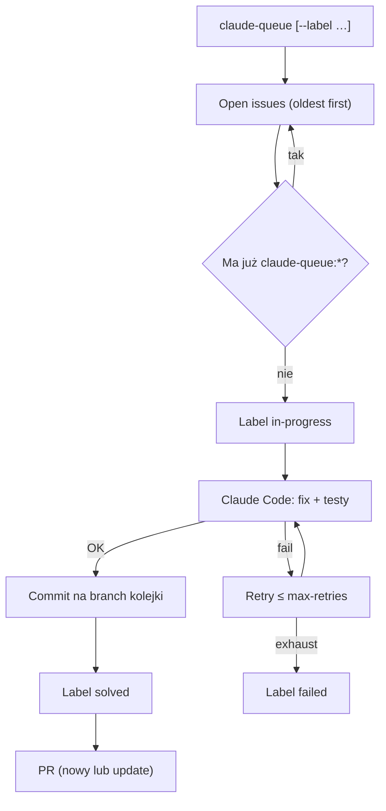

<!-- spine: spine_agent_loop -->
# claude-queue (`nilbuild/claude-queue`)

CLI klepacz: bierze open issues (opcjonalnie filtrowane `--label`), odpala Claude Code jedno po drugim, oznacza `claude-queue:in-progress|solved|failed` i zbiera zmiany w PR (domyślnie branch dzienny). Prostszy niż fabryka — nocny batch ticket→PR na lokalnej maszynie.

## Co / gdzie / jak

| Element | Szczegóły |
|--------|-----------|
| **Trigger** | Ręczne / cron lokalny: `claude-queue` lub `npx claude-queue`; filtr `--label` (np. `work:ready` / własna etykieta gotowości) |
| **Sandbox** | Lokalny checkout / branch `claude-queue/<date>`; wymaga `gh` + `claude` na PATH |
| **Agent** | Claude Code CLI; model przez `--model` |
| **Testy** | Prompt każe uruchamiać testy w trakcie solve; retry z resetem tree przy braku zmian |
| **Merge** | Człowiek — narzędzie otwiera/aktualizuje PR; review rano po nocnym batchu |

## Confidence: **74 / 100**

Najwyższy social proof w tej fali (~89★), jasny label state dla kolejki, `--label` jako gate „gotowe dla agenta”. Obniżka: to nie event-driven GHA (brak natywnego `issues: labeled`), batch na jeden branch może mieszać wiele ticketów w jednym PR, brak niezależnego reviewera w core.

## Linki

- Repo: https://github.com/nilbuild/claude-queue
- npm: `npm i -g claude-queue` / `npx claude-queue`
- Docs: README (flags `--issue`, `--label`, `--max-retries`, `create`)
