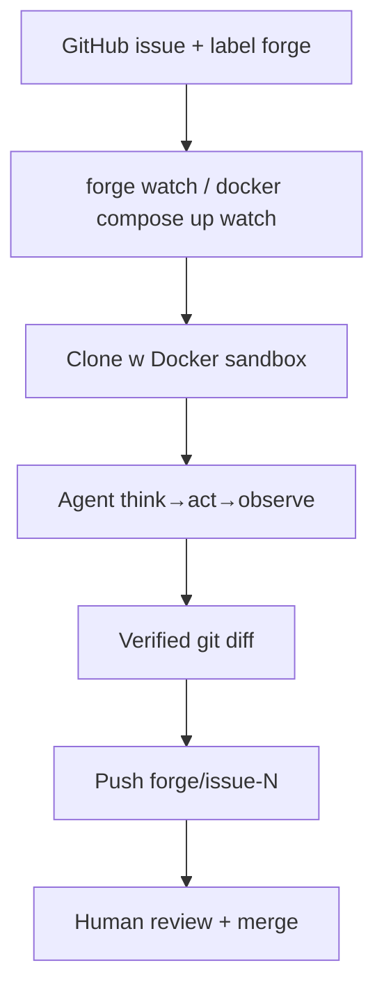

# Forge (OkeyAmy)

**Repo:** [OkeyAmy/forge](https://github.com/OkeyAmy/forge) · ★5 · Rust · Docker-first · license NOASSERTION

## Co to jest

Lokalny **forge mill CLI**: `forge watch --label forge` polluje repo, bierze issue z etykietą, klepie fix w **Docker sandbox**, pushuje branch `forge/issue-{N}`. One-shot: `forge run --repo --issue`. Czysty kształt klepacza (label = weź); człowiek reviewuje i merguje.

## Graf

## Co / gdzie / jak

| Warstwa | Mechanizm |
|---------|-----------|
| **Trigger** | Etykieta `FORGE_WATCH_LABEL` (domyślnie `forge`); poll interval |
| **Stan** | `trajectories/watch_state.json` — bez double-process |
| **Role** | Jeden agent SWE w sandboxie |
| **Sandbox** | Docker isolate; OpenAI-compatible model API |
| **Testy** | W pętli agenta (SWE-agent style) |
| **Merge** | Push branch tylko; merge = człowiek |
| **Daemon** | `docker compose up watch -d` + restart unless-stopped |

Textbook lokalny label→implement→branch (krok od draft PR).

## Confidence

**86 / 100** — idealny mechanizm etykiety; ★5 + young; brak natywnego `gh pr create` w happy-path (branch-only).

## Linki

- https://github.com/OkeyAmy/forge
