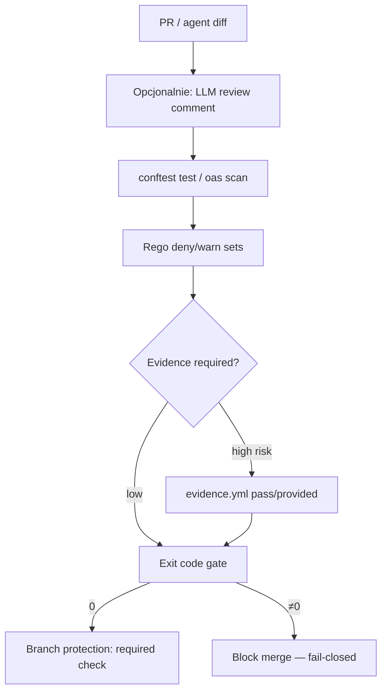

<!-- spine: spine_deterministic -->
# Conftest / OPA merge gates (`open-policy-agent/conftest`)

**spine:deterministic** · **Confidence: 93** — decyzja merge/blok = Rego + exit code; **zero LLM** w bramce; graph-is-code = policy-as-code.

## Co to jest

Conftest = CLI nad OPA: testujesz YAML/JSON/HCL/Dockerfile/… regułami Rego (`deny`/`warn`/`violation`). W fabryce klepacza: **merge_gate bez modelu** — size/path/protected resources, TF plan, K8s manifests, capability JSON. LLM-review może iść *przed* bramką; werdykt merge nigdy nie jest „LLM approved”. Pokrewne: OpenAgentSecurity (`oas scan` → evidence YAML → `oas gate` fail-closed) oraz gp-foundry `agents/policy/merge.yaml`.

## Graf

## Co / gdzie / jak

| Element | Wartość |
|---------|---------|
| Stack | **Go** Conftest · OPA Rego · ★~3259 |
| Trigger | CI job na PR (GHA/GitLab) |
| Orkiestracja | Policy files w repo; `conftest test` / `opa test` |
| LLM slot | **Brak** w bramce (opcjonalny narrative *przed*) |
| Agent-free | Ewaluacja Rego, exit codes, artefakty, block merge |
| Wariant agentowy | OpenAgentSecurity: diff → risk rules → evidence → `oas gate` |
| Anti-pattern | „LLM reviewer approved ⇒ merge” bez policy check |

## Linki

- https://github.com/open-policy-agent/conftest
- Docs: https://www.conftest.dev/
- OPA: https://www.openpolicyagent.org/
- Pokrewne: OpenAgentSecurity (evidence gate) · gp-foundry merge.yaml
- WAVE3 §7
