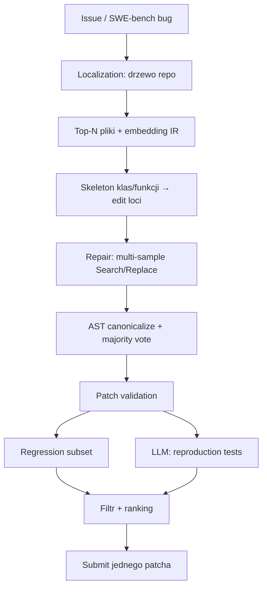

<!-- spine: spine_deterministic -->
# Agentless (`OpenAutoCoder/Agentless`)

**spine:deterministic** · **Confidence: 95** — kanon „graph-is-code”: sztywne 3 fazy, zero ReAct/tool-loop; LLM tylko w slotach localize/repair/(repro-test).

## Co to jest

Paper + repo UIUC: *Agentless: Demystifying LLM-based Software Engineering Agents* (arXiv 2407.01489, FSE’25). Argument empiryczny: **ustalone fazy biją wielu agentów** na SWE-bench (lite ~27–41%, verified ~50% z Claude 3.5) przy niskim koszcie. Nie ma autonomicznego wyboru narzędzi — kolejność, format diff, AST, majority vote i runner testów są skryptem.

## Graf

## Co / gdzie / jak

| Element | Wartość |
|---------|---------|
| Stack | **Python 3.11** · prompts + preprocessing · Docker/SWE-bench |
| Trigger | Batch / CLI na issue (nie label-GitHub klepacz) |
| Orkiestracja | **Stała** localize → repair → validate — agent-free routing |
| LLM slot | Ranking plików/elementów · kandydaci patchy · repro-testy |
| Agent-free | Format diff, AST, majority vote, uruchomienie testów, budżet sample’ów |
| Nie robi | ReAct, otwarty shell, planowanie „co dalej?”, merge PR |
| Limit | Bugfix z testami; słabiej na feature/eksplorację |

## Linki

- https://github.com/OpenAutoCoder/Agentless ★~2109 · MIT
- Paper: https://arxiv.org/abs/2407.01489
- Decoded: https://www.eulerfold.com/research-decoded/agentless-demystifying-software-engineering-agents
- KB: [`../../oss/agentless.md`](../../oss/agentless.md) · WAVE3 §3
