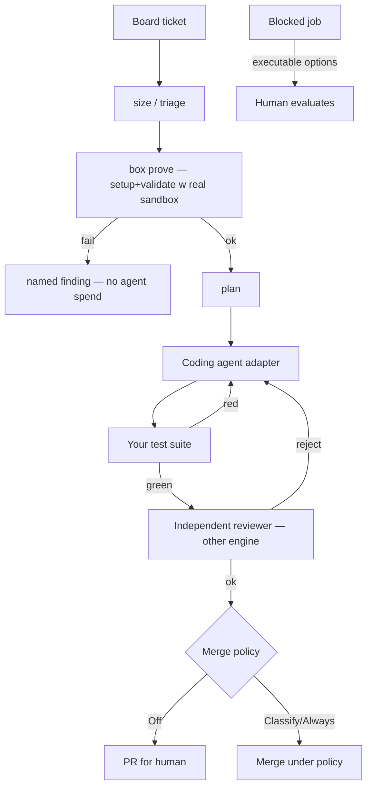

<!-- spine: spine_deterministic -->
# openfactory-core (OpenFactory Digital)

**Repo:** [Open-Factory-Digital/openfactory-core](https://github.com/Open-Factory-Digital/openfactory-core) · ★4 · Python · Apache-2.0

> Nie mylić z [numman-ali/openfactory](https://github.com/numman-ali/openfactory) (SDLC Refinery/Foundry) ani z Open Factory Digital manufacturing.

## Co to jest

Autonomous software factory: **tickets in → reviewed PRs out**. Nie jest coding agentem — orkiestruje Claude Code / Codex / Kimi / OpenCode za adapterem. Board + forge + CI + sandbox + merge policy to osobne osie. `box prove` dowodzi sandboxa **zanim** spalisz tokeny. Honest `docs/STATUS.md`.

## Graf

## Co / gdzie / jak

| Warstwa | Mechanizm |
|---------|-----------|
| **Trigger** | Board columns / ticket pickup (GH Issues+Projects, Jira, Azure DevOps) |
| **Stan** | Worker + panel UI (:8787); Temporal-ish state machine w docs |
| **Role** | Executor ≠ Reviewer (różne silniki) |
| **Sandbox** | Docker compose worker; `box prove` przed kasą |
| **Testy** | Brak zadeklarowanego test command = **hold**, nie pass |
| **Merge** | Polityka w manifeście; produkcja zawsze za human gate |
| **Adapters** | tracker / board / forge / CI / agent / sandbox / notifier |

Najbliższy „produkcyjnemu” OSS klepaczowi wśród low-star: uczciwy STATUS, adapter axes, vacuous-green refusal.

## Confidence

**74 / 100** — spójna teza i onboarding; ★4 early; część osi może być partial (czytać STATUS.md).

## Linki

- https://github.com/Open-Factory-Digital/openfactory-core
- docs/ONBOARDING.md, docs/STATUS.md
- docs/setup/azure-devops.md
