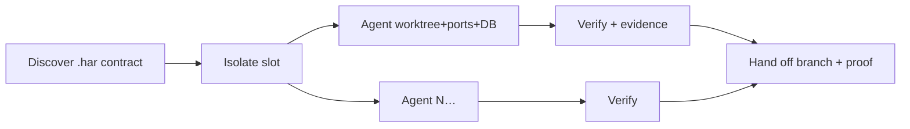

<!-- spine: spine_deterministic -->
# HAR (os-factory)

**Repo:** [os-factory/har](https://github.com/os-factory/har) · ★88 · TypeScript · Apache-2.0 · npm `@osfactory/har` · docs harproject.dev

## Co to jest

Open **agent harness** / worktree fleet: CLI + MCP. Slot = izolowany worktree + porty + DB; etapy Discover → Isolate → Build → Verify → Hand off (branch + evidence). Mission Control = lokalny dashboard. Nie wybiera ticketów sam — to warstwa zaufania pod Claude/Cursor/Codex.

## Graf

## Co / gdzie / jak

| Warstwa | Mechanizm |
|---------|-----------|
| **Trigger** | `har env launch N` / MCP tools / agent workflow |
| **Stan** | `.har/` contract w repo; Mission Control DB |
| **Role** | Harness wokół dowolnego agenta (nie własny LLM mill) |
| **Sandbox** | Worktree + stack per slot |
| **Testy** | Deterministic verify stages + tree hash evidence |
| **Merge / PR** | Hand-off branch; reviewer dostaje proof — PR poza core |
| **Flota** | Native multi-slot concurrent |

„Issue implementer harness” w sensie infrastruktury pod klepacza, nie kompletny label mill.

## Confidence

**72 / 100** — solidny OSS harness + docs; nie jest sam ticket→PR (trzeba dokleić kolejkę).

## Linki

- https://github.com/os-factory/har
- https://harproject.dev/
