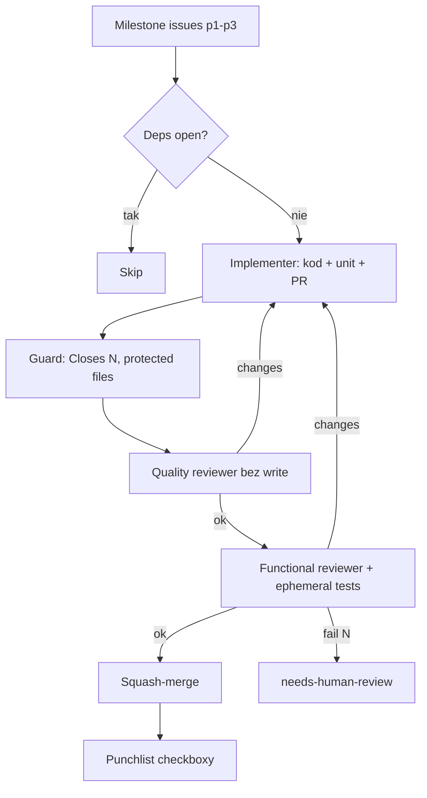

# peter-stratton/dark-factory (`godark`)

**Confidence: 90** — pełny mill issue→PR→merge z adversarial review; bliżej harness+klepacz niż L5 banku, ale ma escalate `needs-human-review`.

## Co to jest

Go CLI + Claude Code: milestone issues → implementer → quality reviewer → functional reviewer → squash-merge lub escalate. Harness = design.

## Graf

## Co / gdzie / jak

| Element | Wartość |
|---------|---------|
| Trigger | Milestone + priority; deps w body |
| Sandbox | Docker ephemeral |
| Role | Implementer ≠ reviewers (izolacja uprawnień) |
| Merge | Auto squash lub escalate |
| Host | Laptop + Docker, nie flota |

## Linki

- https://github.com/peter-stratton/dark-factory
- https://godarkfactory.com
