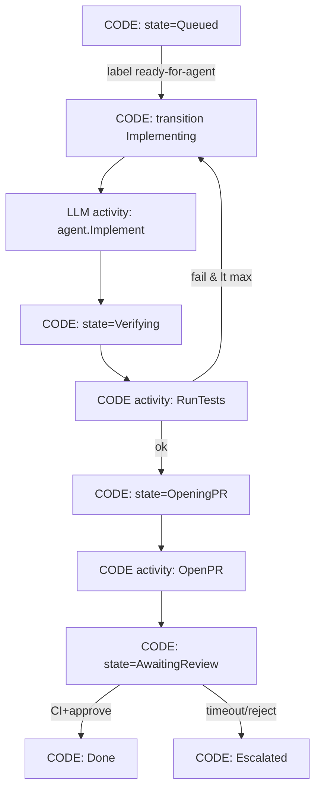

<!-- spine: spine_deterministic -->
# Plain Python/Go FSM — state machine woła agentów jako activities

**spine:deterministic**  
**Confidence: 88** — najcieńszy kanon P1.3 bez vendor lock: jawny enum stanów + transition table w kodzie; LLM tylko w funkcjach „activity”; wzorzec widoczny w Stripe Blueprints, DAGent while+DAG, label-FSM mills.

## Co to jest

Zamiast Temporal/Inngest możesz mieć **zwykły** deterministyczny automat:

- stany: `Queued → Implementing → Verifying → OpeningPR → AwaitingReview → Done | Escalated`
- przejścia: czysta funkcja `(state, event) → state` w Python/Go
- side-effecty: `activities.Implement(ctx, issue)` które *wewnątrz* wołają Claude/Codex
- persystencja: SQLite / Postgres / GitHub labels jako store

To ten sam kontrakt co Temporal Workflow/Activity, tylko Ty piszesz replay/persist. Dla małego młyna (jeden worker, jedna kolejka) często wystarcza — i **nie** oddaje spine modelowi.

## Graf

## LLM vs code (węzły)

| Węzeł | Typ | Uwaga |
|-------|-----|--------|
| enum stanów, transition table, guardy, limity | **CODE** | Jedyna prawda „co dalej?” |
| RunTests, OpenPR, Merge, label mutate | **CODE** activities | Bez modelu |
| Implement / FixCI / opcjonalny review text | **LLM** activities | Budżet attemptów w FSM |
| Persist state | **CODE** | DB lub labels — nie context window |

## Co / gdzie / jak

| Element | Wartość |
|---------|---------|
| Trigger | Poller / webhook → `FSM.Handle(event)` |
| Spine | ~200–500 LOC Python/Go + store |
| Agent leaf | subprocess CLI lub SDK w activity |
| Upgrade path | Gdy potrzeba replay/HA → przenieś ten sam podział do Temporal Activities |
| Nie robi | `if llm.say("should we merge")` jako transition |

## Linki

- Wzorzec KB: [PATTERNS.md P1.3 / P2.1](../../PATTERNS.md)
- Stripe Blueprints (hybrid): [stripe-minions](../stripe-minions/)
- DAGent while+DAG: [dagent](../dagent/)
- O’Reilly: https://www.oreilly.com/radar/keep-deterministic-work-deterministic/
