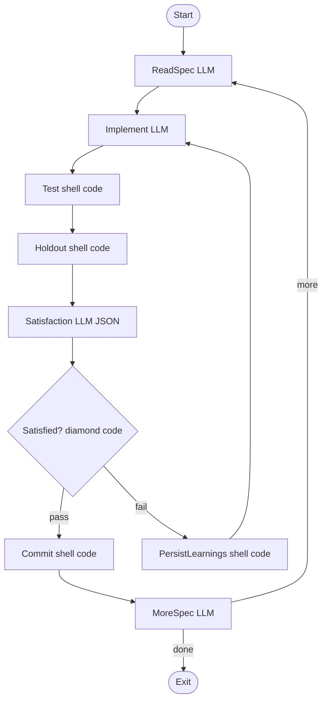

<!-- spine: spine_deterministic -->
# point-labs-dev/arc

**spine: deterministic** — silnik TypeScript/Effect.ts chodzi po `pipelines/convergence.dot`; brak imperatywnej orkiestracji poza `runPipeline`.

**Confidence: 90** — „engine walks the graph — no imperative orchestration code”; holdout scenarios poza wzrokiem agenta.

## Co to jest

Software factory: SPEC.md → pętla konwergencji jako **stały** graf DOT. Świeży kontekst na każdą próbę; learnings na dysku; shell/test węzły jako parallelogram.

## Graf (FIXED — `convergence.dot`)

## LLM vs code

| Węzeł | Typ |
|-------|-----|
| Start / Exit / Check (diamond + conditions) | **code** |
| Test / Holdout / PersistLearnings / Commit (`parallelogram`) | **code** (shell) |
| ReadSpec / Implement / Satisfaction / MoreSpec | **LLM** leaf |
| `src/engine/` DOT runner | **code** |

## Linki

- https://github.com/point-labs-dev/arc
- Attractor: https://github.com/strongdm/attractor
