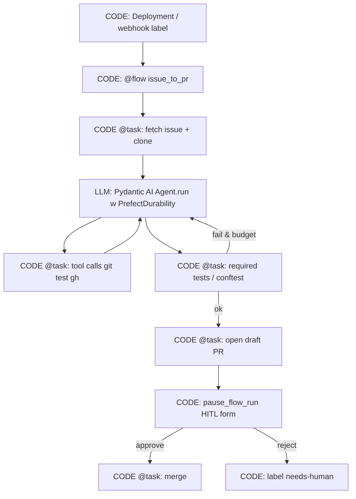

<!-- spine: spine_deterministic -->
# Prefect + Pydantic AI — flow/task jako spine klepacza

**spine:deterministic**  
**Confidence: 86** — oficjalna integracja Prefect × Pydantic AI (`PrefectDurability`): model/tool calls = taski z cache/retry; flow Python = kontrola przebiegu issue→PR bez oddawania routingu LLM-owi.

## Co to jest

**Prefect 3** orchestrates Python control flow (while/branch/HITL pause) jako **durable flow**. Dla fabryki: zewnętrzny `@flow` issue→PR trzyma stany (hydrate → implement → verify → open_pr → wait_approval), a agent Pydantic AI jest **liściem** owiniętym taskami (`PrefectDurability` routuje requesty modelu i tool calls przez Prefect tasks). Retries **nie** wołają ponownie LLM, jeśli wynik taska jest w cache.

Uwaga marketingowa Prefect („agents are state machines”) dotyczy *elastycznego* Python flow — w klepaczu **Ty** definiujesz FSM; LLM nie wybiera kolejki merge.

## Graf

## LLM vs code (węzły)

| Węzeł | Typ | Uwaga |
|-------|-----|--------|
| `@flow` branching, retries, cache keys, pause/resume | **CODE** | Transactional semantics Prefect 3 |
| fetch issue, git, pytest, `gh`, merge | **CODE** `@task` | Persist result → idempotent rerun |
| reasoning / patch generation | **LLM** (via durability capability) | Model request = osobny task |
| tool execution MCP/shell | **CODE** task pod spodem | Agent decyduje *czy* wołać; harness wykonuje |

## Co / gdzie / jak

| Element | Wartość |
|---------|---------|
| Trigger | Prefect deployment / cron / event automation |
| Spine | Prefect server/Cloud; flow = Python FSM |
| Agent leaf | Pydantic AI + `PrefectDurability` |
| HITL | `pause_flow_run` + UI forms |
| Nie robi | Wołanie `agent.run()` poza `@flow` (brak durability) |

## Linki

- https://www.prefect.io/solutions/agents
- https://www.prefect.io/blog/prefect-pydantic-integration
- https://pydantic.dev/docs/ai/capabilities/durable_execution/prefect/
