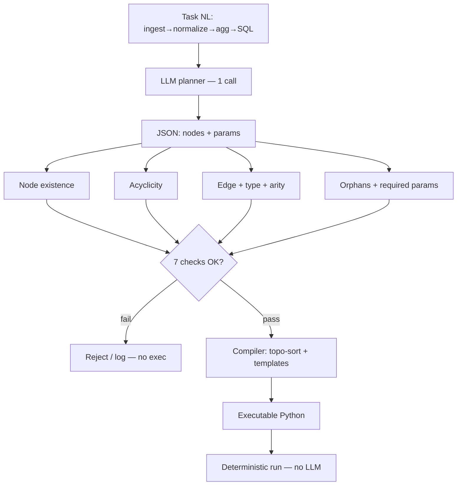

<!-- spine: spine_deterministic -->
# PlanCompiler (`prnvh/plancompiler`)

**spine:deterministic** · **Confidence: 94** — ekstremum graph-is-code: **jeden** call LLM (JSON plan) → 7 checków → kompilacja Pythona; zero dalszych calli, zero repair-loop.

## Co to jest

Constraint-guided program synthesis: LLM **nie pisze kodu**, tylko wybiera węzły z **fixed registry** + parametry. Walidator (istnienie, acyklowość, krawędzie, typy, arity, orphan, required params) fail-closed. Kompilator robi topo-sort i składa executable z template’ów węzłów. Domena: ETL / znane playbooki — nie otwarte GitHub issue bez rozrostu registry.

## Graf

## Co / gdzie / jak

| Element | Wartość |
|---------|---------|
| Stack | **Python** · typed node registry · Apache-2.0 |
| Trigger | CLI / API z opisem zadania |
| Orkiestracja | Validator + compiler — **0 tokenów** po planie |
| LLM slot | **Wyłącznie** planning JSON (wybór węzłów) |
| Agent-free | 7 checków, topo-sort, assembly, execution |
| Nie robi | ReAct, runtime repair, inventowanie nowych węzłów |
| Limit | Skończona biblioteka prymitywów; nie SWE-bench open-ended |

## Linki

- https://github.com/prnvh/plancompiler ★~6
- arXiv: https://arxiv.org/abs/2604.13092
- Writeup: https://prnvh.github.io/compiler.html
- WAVE3 §9
