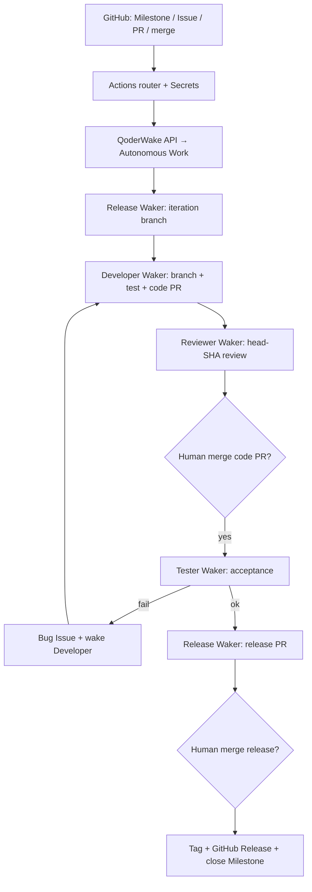

# Qoder AI Employees / QoderWake — Chiny (Alibaba)

**Produkt:** [QoderWake](https://docs.qoder.com/qoderwake/overview) · Enterprise [AI Employees](https://docs.qoder.com/enterprise/solutions/ai-employees) · demo OSS [blue199288/order-coupon-devops-demo](https://github.com/blue199288/order-coupon-devops-demo) (★1)

## Co to jest

Chiński klepacz event-driven: GitHub = źródło prawdy; Actions filtruje zdarzenia i budzi **Wakers** (Release / Developer / Reviewer / Tester) przez QoderWake API. Developer otwiera code PR; Reviewer pisze marker `[QW-REVIEW][sha][PASS|…]`; człowiek merguje; Tester po merge waliduje i wraca bugiem; Release przygotowuje release PR + tag. To **nie** Trae SOLO / Quest Mode (IDE) — to osobna warstwa delivery. Quest/harness community nadal nie mill.

## Graf

## Co / gdzie / jak

| Warstwa | Mechanizm |
|---------|-----------|
| **Trigger** | Eventy GitHub (requirement → ready-dev, PR create/push, merge do iteration, retest) — nie idle poll |
| **Stan** | Issue/Milestone/PR + markery (`[QW-DEMO][DEV][READY]`, `[QW-REVIEW][sha][PASS]`); BIBLE.md per rola |
| **Role** | 4 niezależne Wakers + oddzielne API tasks; Developer ≠ Reviewer ≠ Tester ≠ Release |
| **Sandbox** | Isolated mode QoderWake; CI osobno w GHA |
| **Testy** | Developer lokalne + CI; Tester niezależna akceptacja po merge |
| **Merge** | Zawsze człowiek (code PR i release PR); Release nie merguje |

Vendor lock QoderWake runtime; kształt klepacza udokumentowany + demo launcher.

## Confidence

**78 / 100** — oficjalne docs Qoder + żywe demo repo z routerem/markerami; brak masowego publicznego dogfood poza demem; zamknięty runtime.

## Linki

- https://docs.qoder.com/enterprise/solutions/ai-employees
- https://docs.qoder.com/qoderwake/github-devops
- https://github.com/blue199288/order-coupon-devops-demo
- https://docs.qoder.com/qoderwake/overview
