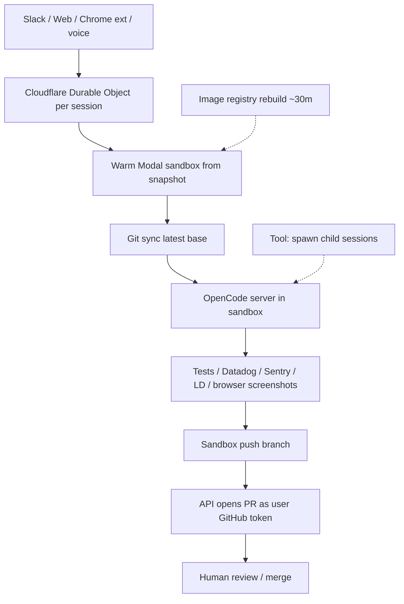

# Ramp Inspect

**Confidence: 91** — oficjalny eng blog Ramp + szczegółowy „paste this into an agent” spec; brak publicznego repo Inspect; harness OpenCode OSS.

## Co to jest

Wewnętrzny **background coding agent** Ramp: sesja w sandboxie Modal z pełnym stackiem inżyniera (testy, telemetria, feature flags, visual verify) → PR. Multiplayer; Slack / web / Chrome extension. Organiczna adopcja (~30%+ merged PR FE/BE).

## Graf

## Co / gdzie / jak

| Element | Wartość |
|---------|---------|
| Trigger | Chat (Slack/web), Chrome React grab, PR follow-up — nie wąska etykieta |
| Control plane | Cloudflare Durable Objects (SQLite/session) + Agents SDK WebSocket |
| Data plane | **Modal** sandboxes + FS snapshots; pool warm; TTFT ≈ model |
| Agent runtime | **OpenCode** (server-first, model-agnostic, plugins) |
| Env | Vite, Postgres, Temporal + Sentry, Datadog, LaunchDarkly, Braintrust, Buildkite |
| Auth/PR | Push z sandboxa; PR przez **user** GitHub token (nie app-as-author) |
| Merge | Ludzki; metryka = merged PR share |
| Nie robi | Public OSS Inspect; lokalny-only worktree mill |

## Linki

- https://engineering.ramp.com/post/why-we-built-our-background-agent (primary architecture + buildable spec)
- https://newsletter.pragmaticengineer.com/p/why-ramp-built-inspect
- https://www.infoq.com/news/2026/01/ramp-coding-agent-platform/
- Secondary: https://rywalker.com/research/ramp-inspect
