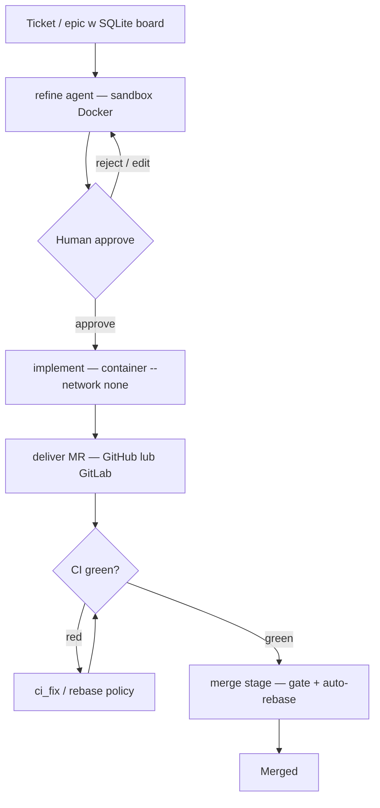

# robotsix-mill

**Repo:** [damien-robotsix/robotsix-mill](https://github.com/damien-robotsix/robotsix-mill) · ★1 · Python · MIT · EU (Damien Robotsix)

## Co to jest

Samodzielny młyn LLM: ticket wchodzi, merge request wychodzi. Orkiestracja **nie zależy od forge** — SQLite + event-driven worker; GitHub/GitLab tylko na etapie *deliver*. Po refine jest bramka człowieka; dalej refine→implement→deliver→merge (gdy CI zielone) idzie bez babysittingu. Dogfooded (bot `robotsix-mill` merguje setki PR do siebie).

## Graf

## Co / gdzie / jak

| Warstwa | Mechanizm |
|---------|-----------|
| **Trigger** | `ticket new` / board UI — brak webhooków forge; mill sam polluje kolejkę |
| **Stan** | SQLite (ticket, run logs, cost); kolumny boardu = FSM |
| **Role** | refine → (approve) → implement → deliver → merge; osobno ci_fix, retrospect, audit |
| **Sandbox** | Disposable Docker: non-root, RO rootfs, `--network none`, path confinement |
| **Testy** | Repo CI jako wyrocznia; stage `ci_fix` batchuje fixy, limity requestów |
| **Merge** | Merge stage: gate-check, rebase tylko przy real conflicts, WIP cap `max_inflight_prs` |
| **Multi-repo** | `repos:` w `config.yaml` — `board_id` obowiązkowy |

Czysty kształt **klepacza**: człowiek pisze/akceptuje ticket, agent klepie MR. Nie L5 „odkryj produkt”.

## Confidence

**88 / 100** — kod żywy, pipeline E2E, setki self-PR, dokumentacja stage’ów; ★1 = obscure, nie vapor.

## Linki

- https://github.com/damien-robotsix/robotsix-mill
- [docs/stages/approval-gate.md](https://github.com/damien-robotsix/robotsix-mill/blob/main/docs/stages/approval-gate.md)
- [docs/stages/merge-stage.md](https://github.com/damien-robotsix/robotsix-mill/blob/main/docs/stages/merge-stage.md)
- [docs/forge/architecture.md](https://github.com/damien-robotsix/robotsix-mill/blob/main/docs/forge/architecture.md)
