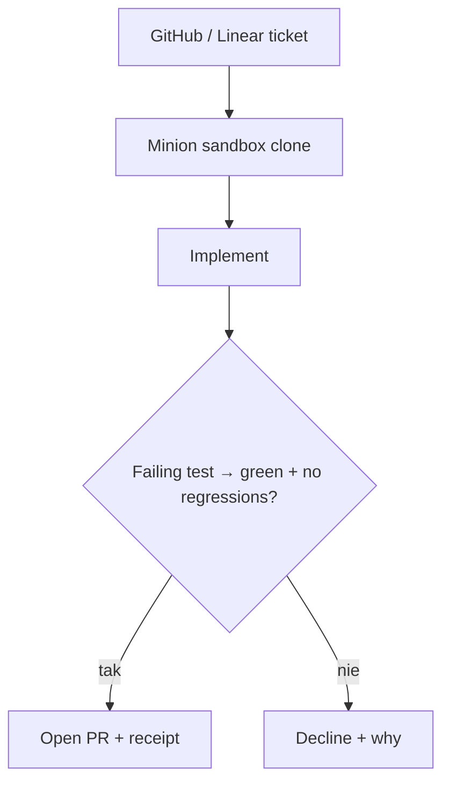

<!-- spine: spine_agent_loop -->
# Agent Forge (Minions)

**Repo:** [salehaiftikharr/agent-forge](https://github.com/salehaiftikharr/agent-forge) · ★0 · TypeScript · MIT · CLI `forge`

## Co to jest

**Issue implementer** z twardą bramką weryfikacji: Minion bierze ticket (GitHub/Linear), fix na sandboxed clone, odpala suite, **otwiera PR tylko gdy wcześniej padający test przechodzi** (i nie może edytować testów-sędziów). Inaczej decline + receipt. Ten sam silnik: CLI, Slack, web. Osobno: `forge build` buduje agentów z plain English.

## Graf

## Co / gdzie / jak

| Warstwa | Mechanizm |
|---------|-----------|
| **Trigger** | `forge pr owner/repo N`, `forge minion all`, Slack |
| **Stan** | Receipts / runs audytowalne |
| **Role** | Minion (implement) vs Forge-builder (meta); testy read-only dla miniona |
| **Sandbox** | Clone sandbox per ticket |
| **Testy** | Verification gate = wcześniej failing test |
| **Merge** | PR only; merge ludzki |
| **Eval** | Claim: 0 unsafe ships na labeled set |

Najbliższy „prove-then-PR” forge CLI w fali; ★0 = śledzić dogfood.

## Confidence

**74 / 100** — ideologia klepacza + gate testowy wzorowa; mało gwiazdek / młody; część surface = product web.

## Linki

- https://github.com/salehaiftikharr/agent-forge
- Demo PR: https://github.com/salehaiftikharr/forge-minions-demo/pull/2
