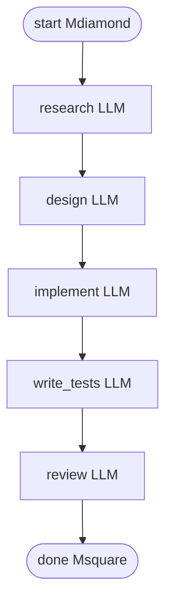

<!-- spine: spine_deterministic -->
# samueljklee/attractor

**spine: deterministic** — silnik Python przechodzi graf DOT; LLM tylko wypełnia węzły `box` / codergen.

**Confidence: 92** — „graph is code, agent is leaf”: pełna implementacja StrongDM Attractor nlspec z CLI + HTTP/SSE; `validate` bez API key.

## Co to jest

DOT-based pipeline runner: węzeł = zadanie (LLM, shell/tool, human gate, diamond condition), krawędź = flow. Spec StrongDM bez kodu → tu działa `attractor_pipeline.cli run examples/*.dot`.

## Graf (FIXED — przykład `software_factory.dot`)

Inne gotowe: `spec_driven_dev.dot` (catalog→validate→gate→plan→implement→verify→tests), `supervisor_loop.dot`, `human_approval.dot`, `parallel_approaches.dot`.

## LLM vs code

| Węzeł / warstwa | Typ |
|-----------------|-----|
| Parser DOT + `PipelineRunner` + checkpoint/SSE | **code** (deterministyczny walk) |
| `shape=diamond` / conditions / retries | **code** |
| `shape=parallelogram` tool / shell | **code** (lub tool leaf) |
| `shape=box` + `prompt=` | **LLM** (leaf) |
| `shape=hexagon` human gate | HITL (nie LLM) |
| Unified LLM client + coding agent loop | leafy agent wewnątrz boxa |

## Linki

- https://github.com/samueljklee/attractor
- Spec: https://github.com/strongdm/attractor
