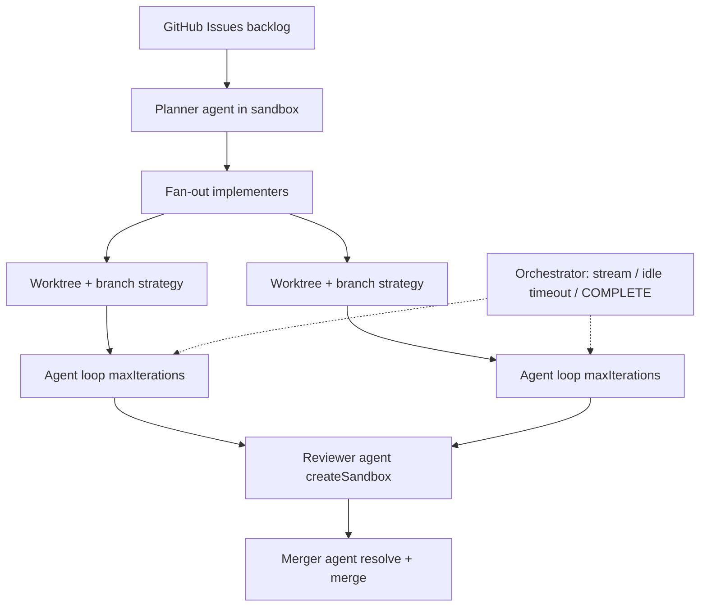

<!-- spine: spine_agent_loop -->
# Sandcastle (AFK loops)

**Confidence: 93** — publiczne repo `mattpocock/sandcastle` + eseje/wideo „AFK software factory”; biblioteka orkiestracji, nie SaaS.

## Co to jest

TypeScriptowy **sandbox orchestrator** AFK: `sandcastle.run()` odpala agenta (Claude Code / Codex / …) w Docker/Podman/Vercel, na git worktree, z pętlą iteracji do completion signal. Szablony: planner → parallel implementers → reviewer → merger (GitHub Issues jako backlog).

## Graf

## Co / gdzie / jak

| Element | Wartość |
|---------|---------|
| Stack | TypeScript + Effect; providers Docker / Podman / Vercel |
| Trigger | Twój skrypt / template (np. issues label) — Sandcastle = primityw `run` |
| Isolation | Git worktree + container bind-mount (lub sync u isolated providers) |
| Branch strategy | `head` \| `merge-to-head` \| `branch` (reuse + ff-only gdy safe) |
| Loop | Prompt preprocess w sandboxie → invoke agent CLI → parse stream → completionSignals |
| Pattern | `createSandbox()` = warm implement→review na jednej gałęzi |
| Merge | Template merger / merge-to-head; AFK bez permission prompts (sandbox blast radius) |
| Nie robi | Hosted mill SaaS; wybór product backlog za Ciebie |

## Linki

- https://github.com/mattpocock/sandcastle (★~7.9k)
- https://moderncreator.app/2026-04-30-matt-pocock-i-open-sourced-my-own-afk-software-factory
- https://www.youtube.com/watch?v=E5-QK3CDVQM
- https://deepwiki.com/mattpocock/sandcastle/4.1-orchestrator:-the-iteration-loop
