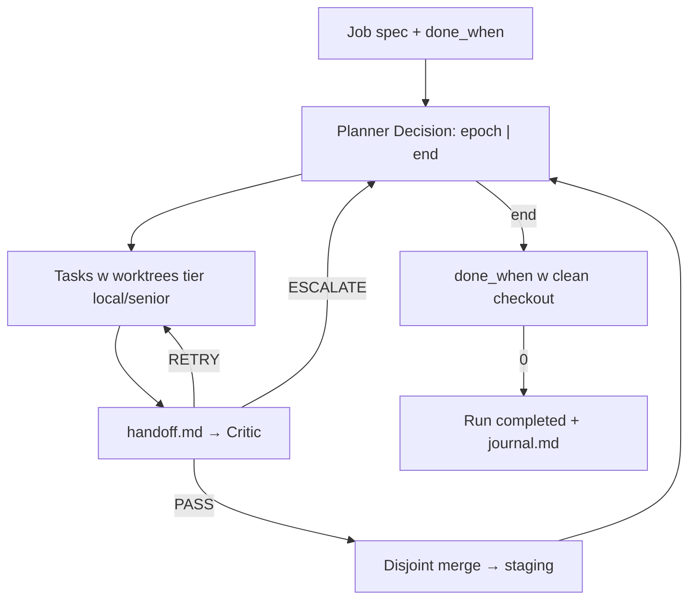

<!-- spine: spine_deterministic -->
# Grindstone (`shbhmydv/Grindstone`)

Epoch-based deep-work orchestrator: dajesz **job spec**, stateless planner proponuje epoki (1–8 disjoint tasks), workers w throwaway worktrees, critic PASS/RETRY/ESCALATE, state machine aż **`done_when` exit 0**.

## Co / gdzie / jak

| Element | Szczegóły |
|--------|-----------|
| **Trigger** | Lokalny job (CLI); nie natywny GitHub Issues label |
| **Sandbox** | Throwaway worktrees per task; journal `events.ndjson` (resume) |
| **Agent** | Tier `local` (np. Qwen) vs `senior` (Claude); skills per task |
| **Testy** | Dwa invariant: disjoint-ownership merge + final `done_when`; critic nie parsuje stdout |
| **Merge** | Staging branch w runie; PR do remote = poza core (job-centric) |

## Confidence: **72 / 100**

Najlepszy „model proposes, state machine disposes” w briefie Grindstone — deterministyczne bramki. Obniżka: ★41, to job/spec mill, nie label→issue queue; trzeba owinąć w ticket adapter.

## Linki

- Repo: https://github.com/shbhmydv/Grindstone
- Watch: `grindstone watch` (live tree z journal)
