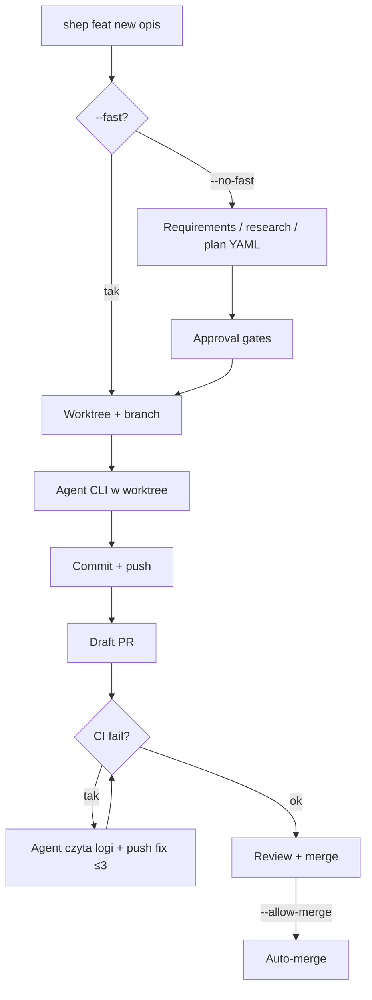

# shep-ai/shep (`@shepai/cli`)

**Confidence: 86** — lokalny npx daemon + worktree fleet: opis → (opcjonalne spec gates) → agent → commit/push/CI-fix → draft PR; merge tylko z flagą.

## Co to jest

Shep (MIT, Node 22+) to lokalny orchestrator floty coding agentów. `npx @shepai/cli` odpala daemon + dashboard (`localhost:4050`). Każdy feature = osobny git worktree + branch; agent (Claude / Cursor / Gemini / dowolny CLI) implementuje; Shep robi commit, push, draft PR i CI watch z auto-fix. Domyślnie człowiek trzyma merge.

## Graf

## Co / gdzie / jak

| Element | Wartość |
|---------|---------|
| Stack | **Node/TypeScript** CLI + web daemon; SQLite w `~/.shep/` |
| Install | `npx @shepai/cli` / `npm i -g @shepai/cli` |
| Trigger | CLI `shep feat new` (nie label-poll — prompt/feat oriented; PR-first) |
| Sandbox | Worktree per feature; main checkout nietknięty |
| Agent | Claude Code, Cursor CLI, Gemini CLI, generic executor |
| CI | Watch + auto-fix (domyślnie 3 retry) |
| Merge | Off domyślnie; `--allow-merge` / `--allow-all` opt-in |
| Nie robi | Sam wybór backlogu z GitHub Issues (to feat-desc → PR, nie label-daemon) |

## Linki

- https://github.com/shep-ai/shep
- npm: https://www.npmjs.com/package/@shepai/cli
- Hosted UI: https://app.shep.bot
