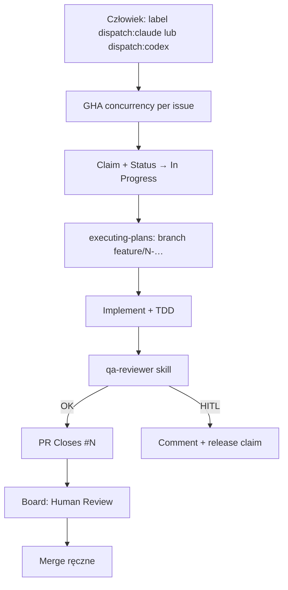

<!-- spine: spine_deterministic -->
# shipshitdev/skills — label dispatch (`dispatch:claude` / `dispatch:codex`)

Marketplace skilli + gotowe GitHub Actions, które po etykiecie **`dispatch:claude`** (lub **`dispatch:codex`**) odpalaają autonomiczny loop: claim → branch → implement (TDD) → qa-reviewer → PR → kolumna Human Review. Historycznie gate nazywał się `ready-for-agent` / `ready-for-codex`; obecny kontrakt to `dispatch:*`.

## Co / gdzie / jak

| Element | Szczegóły |
|--------|-----------|
| **Trigger** | `issues: types: [labeled]` — `dispatch:claude` → `agent-dispatch.yml`; `dispatch:codex` → `codex-dispatch.yml` (także lane `openrouter`) |
| **Sandbox** | Runner GHA; Claude Code Action / `openai/codex-action` (`sandbox: workspace-write` po stronie Codex); `persist-credentials: false` na checkout |
| **Agent** | Claude (OAuth `CLAUDE_CODE_OAUTH_TOKEN`, model z `vars.AGENT_MODEL`) lub Codex (`OPENAI_API_KEY`); skille z marketplace `shipshitdev/skills` |
| **Testy** | Skill `qa-reviewer` + TDD w promptcie executing-plans; status board (Backlog / In Progress / Human Review / …) |
| **Merge** | Człowiek — completion ustawia Human Review i assignuje reviewera; brak auto-merge w dispatchu |

## Confidence: **85 / 100**

Najczystszy „label → AFK implement → PR” w tej fali: pinned SHA actionów, concurrency, least-privilege, świadomy trust boundary (body issue = untrusted). Obniżka: to przede wszystkim skill marketplace (~35★) z workflowami dogfood — consumer musi odpalić `setup-dev-loop.sh` / skopiować YAML; nazewnictwo labeli ewoluowało (`ready-for-agent` → `dispatch:*`).

## Linki

- Repo: https://github.com/shipshitdev/skills
- Claude lane: `.github/workflows/agent-dispatch.yml`
- Codex lane: `.github/workflows/codex-dispatch.yml`
- Setup: `scripts/setup-dev-loop.sh`
- Docs loop: szukaj `AI-DEV-LOOP.md` / skill `executing-plans` w repo
