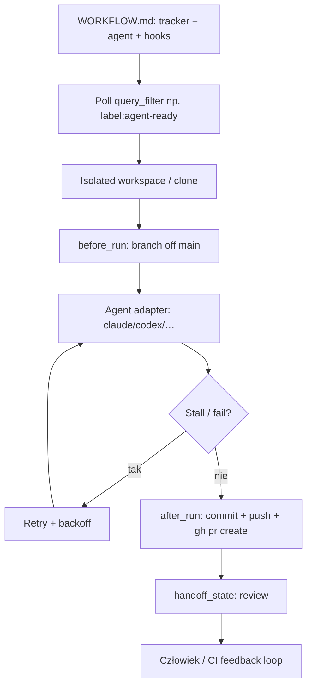

# sortie-ai/sortie

**Confidence: 90** — single-binary Go orchestrator: tracker-agnostic + agent-agnostic; `WORKFLOW.md` + label `agent-ready` → workspace → agent → hooks (commit/PR); stall/retry/SQLite.

## Co to jest

Sortie to lokalny/serwerowy orchestrator (jeden binarek Go, Apache-2.0), który z jednego pliku `WORKFLOW.md` łączy tracker (GitHub/GitLab/Gitea/Linear/Jira) z coding agentem (Claude Code, Copilot CLI, OpenCode, Codex, Kiro, Gemini). Polluje issues (np. `label:agent-ready`), tworzy izolowany workspace, odpala agenta, retryuje stall/timeout i przez hooki `after_run` pushuje + `gh pr create`.

## Graf

## Co / gdzie / jak

| Element | Wartość |
|---------|---------|
| Stack | **Go** single binary; SQLite lokalnie; zero osobnej kolejki |
| Install | `curl … get.sortie-ai.com/install.sh` lub Homebrew cask |
| Trigger | `tracker.query_filter` (np. `label:agent-ready`) + stany active/handoff/terminal |
| Sandbox | Per-issue workspace (hooks: clone / branch); izolacja od main |
| Agent | Adaptery: Claude Code, Copilot, OpenCode, Codex, Kiro, Gemini |
| Tracker | GitHub, GitLab, Gitea, Linear, Jira |
| PR | Typowo w `hooks.after_run` (`gh pr create --fill`) — konfigurowalne |
| Odporność | Stall detection, timeout, retry + exponential backoff, hot-reload workflow |
| Nie robi | L5 produkt; to infrastruktura wokół Twoich agentów |

## Linki

- https://github.com/sortie-ai/sortie
- Docs: https://docs.sortie-ai.com
- Guide issue→PR: https://blog.serghei.pl/posts/from-github-issue-to-pr-with-claude-code/
- Prior art: OpenAI Symphony
