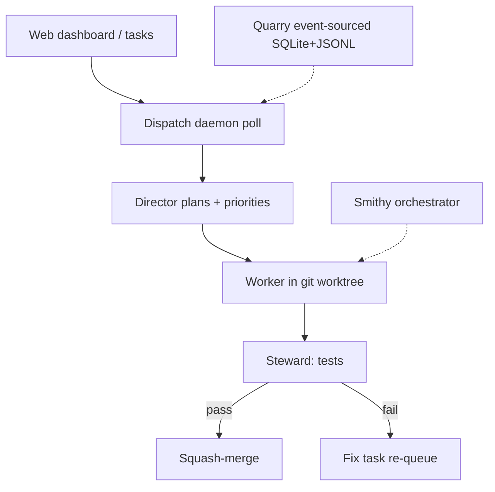

<!-- spine: spine_hybrid -->
# Stoneforge (DEV.to + OSS)

**Confidence: 84** — publiczne repo `stoneforge-ai/stoneforge` + esej DEV.to; early experimental; auto-merge steward (ryzyko).

## Co to jest

OSS **multi-agent mill**: dispatch daemon → Director planuje → Workers w git worktrees → Steward testuje i squash-merge. Dashboard web; Claude Code / Codex / OpenCode. Opublikowane na DEV.to jako orchestration for coding agents.

## Graf

## Co / gdzie / jak

| Element | Wartość |
|---------|---------|
| Stack | Node/Bun TS; Smithy (orchestrator) + Quarry (data SDK) |
| Trigger | Tasks w Stoneforge (agent-first PM stack); daemon co ~5s |
| Isolation | Automatyczny **git worktree** per worker |
| Agents | Claude Code / OpenCode / Codex; permissions bypassed by design |
| Merge | Steward **auto** squash-merge po testach (nie Off-by-default) |
| State | Event-sourced SQLite + JSONL (audit, resume) |
| Nie robi | Dojrzały LTS mill; low-token hobby; HITL przed każdym tool call |

## Linki

- https://github.com/stoneforge-ai/stoneforge (★~179, Apache-2.0)
- https://dev.to/notadamking/introducing-stoneforge-open-source-orchestration-for-ai-coding-agents-1eg2
- https://stoneforge.ai (homepage / blog canonical)
