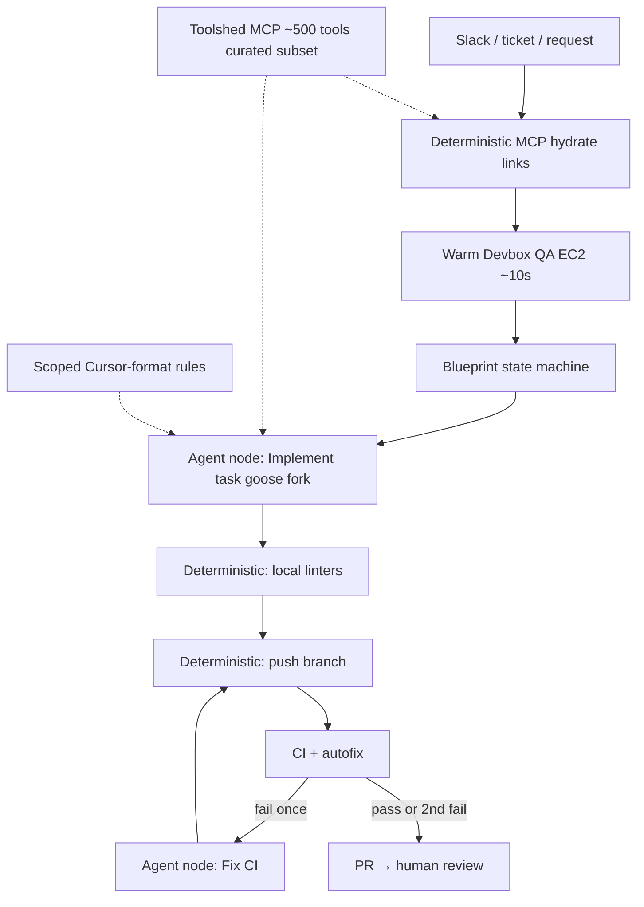

<!-- spine: spine_hybrid -->
# Stripe Minions

**Confidence: 92** — oficjalne eseje Stripe.dev (UX + architektura); brak publicznego repo; metryki własne Stripe (~1300 merged PR/tydzień, zero human-written code, human review).

## Co to jest

Wewnętrzny **unattended** klepacz Stripe: Slack/ticket → izolowany **devbox** → blueprint (agent + deterministyczne węzły) → PR. Ludzie przeglądają; Minions nie są companionem przy IDE (do tego Cursor / Claude Code).

## Graf

## Co / gdzie / jak

| Element | Wartość |
|---------|---------|
| Trigger | Slack / ticket / request (nie jedna publiczna etykieta) |
| Sandbox | **Devbox** = standardowy EC2 Stripe (pool warm, QA, bez prod egress / user data) |
| Harness | Fork **Block goose** + Stripe LLM infra; bez human interrupt |
| Orkiestracja | **Blueprints** = workflow + agent nodes (Anthropic-style hybrid) |
| Context | Scoped rule files (Cursor format) + Toolshed MCP (curated subset) |
| Feedback | Shift-left lint lokalnie; max **2** rundy CI; potem człowiek |
| Merge | Human-reviewed; 0 linii napisanych przez człowieka w diffie Miniona |
| Metryki (Stripe) | >1300 merged PR/tydzień z Minionów |
| Nie robi | Attended pair-programming; dowolny network egress; nieskończona pętla CI |

## Linki

- https://stripe.dev/blog/minions-stripes-one-shot-end-to-end-coding-agents (Part 1 — UX)
- https://stripe.dev/blog/minions-stripes-one-shot-end-to-end-coding-agents-part-2 (Part 2 — Devbox / Blueprints / Toolshed / goose)
- https://www.youtube.com/watch?v=WW-549L6L50 (Building autonomous coding agents at Stripe)
- Secondary: https://lilting.ch/en/articles/stripe-minions-agent-architecture
