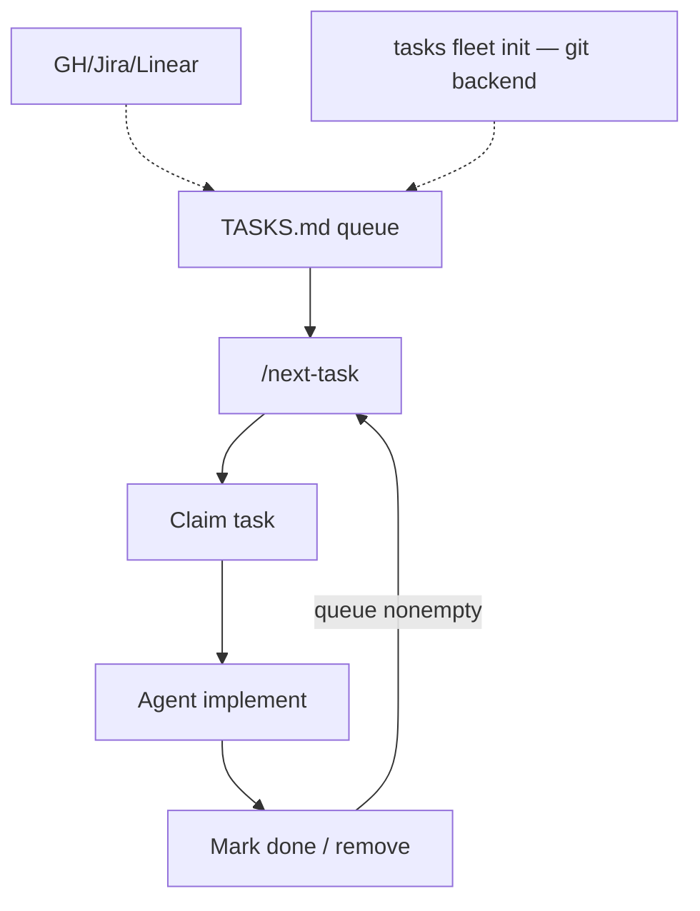

<!-- spine: spine_agent_loop -->
# TASKS.md

**Repo:** [tasksmd/tasks.md](https://github.com/tasksmd/tasks.md) · ★8 · TypeScript · MIT · `@tasks-md/cli`, parser, lint, `tasks-mcp`

## Co to jest

Spec + CLI kolejki agentowej w Markdown — companion do AGENTS.md. Komenda **`/next-task`** = autonomiczna pętla: pick → claim → work → remove → repeat. Backend plikowy albo **git-native fleet** (`tasks fleet init`) bez kolizji multi-writer. Issue trackery (GH/Jira/Linear) mogą zasilać kolejkę (user stories).

## Graf

## Co / gdzie / jak

| Warstwa | Mechanizm |
|---------|-----------|
| **Trigger** | `/next-task` w agentcie; CLI init/install |
| **Stan** | `TASKS.md` w gicie (+ fleet backend) |
| **Role** | Spec kolejki — agent jest silnikiem |
| **Sandbox** | Poza spec (worktree = twoja sprawa / fleet machines) |
| **Testy** | Konwencja AGENTS.md / repo |
| **Merge / PR** | Nie wbudowane — kolejka ≠ forge |
| **Flota** | `tasks fleet init` collision-free |

Warstwa **TASKS.md agent loop**; klepacz powstaje po spięciu z worktree + PR harness.

## Confidence

**70 / 100** — czysty, vendor-neutral spec; mało gwiazdek; sam nie domyka PR.

## Linki

- https://github.com/tasksmd/tasks.md
- https://tasksmd.github.io/tasks.md/
- spec.md + user stories w repo
