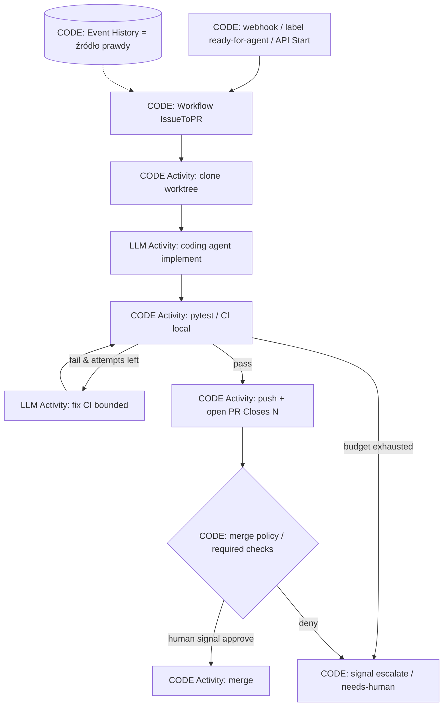

<!-- spine: spine_deterministic -->
# Temporal — Workflow deterministyczny + Activities (klepacz)

**spine:deterministic**  
**Confidence: 94** — kanon P2.1 / WAVE3; Cursor Cloud Agents i Codex production path na Temporal; twarde rozdzielenie replay-safe Workflow vs LLM w Activities.

## Co to jest

**Temporal** jako zewnętrzny mózg transakcji issue→PR: kod Workflow jest **deterministyczny** (replay historii zdarzeń), a LLM / git / testy / `gh` żyją wyłącznie w **Activities**. Crash workera, retry inference, HITL signal — stan wraca z Event History, nie z context window modelu.

Wzorzec fabryki: Hybrid Slot — orkiestrator nigdy nie „myśli”; coding agent to Activity z budżetem (timeout, heartbeat, max attempts) + opcjonalny `continue-as-new` na długie misje.

## Graf

## LLM vs code (węzły)

| Węzeł | Typ | Uwaga |
|-------|-----|--------|
| Start / routing / pętle / timeouts / signals | **CODE** (Workflow) | Zero LLM; musi być replay-safe |
| clone, lint, test runner, `gh pr create`, merge | **CODE** (Activity I/O) | Side-effect, wynik zapisany w historii |
| implement / fix CI / opcjonalny review text | **LLM** (Activity) | Jedyny slot modelu; wynik Activity steruje Workflow |
| merge decision | **CODE** (policy / signal) | Nie persona LLM |

## Co / gdzie / jak

| Element | Wartość |
|---------|---------|
| Trigger | `client.start_workflow` z issue id / label / Slack |
| Spine | Temporal Server / Temporal Cloud; Worker z Workflow + Activities |
| Agent leaf | OpenAI Agents SDK / PydanticAI / Claude CLI zawinięte w Activity |
| HITL | Workflow `wait_condition` + Signal/Update (approve/deny) |
| Durability | Event History; `continue-as-new` przy długich pętlach |
| Nie robi | LLM w ciele Workflow (→ nondeterminism error na replay) |

## Linki

- https://go.temporal.io/platform-hub/ai-engineering/ai-reference-architecture
- https://github.com/temporal-community/temporal-agent-harness
- https://github.com/temporal-community/temporal-ai-agent
- https://temporal.io/blog/announcing-openai-agents-sdk-integration
- https://temporal.io/blog/of-course-you-can-build-dynamic-ai-agents-with-temporal
- Dowód skali w produkcie: [cursor-cloud-agents](../cursor-cloud-agents/) (Temporal Cloud >50M actions/day)
