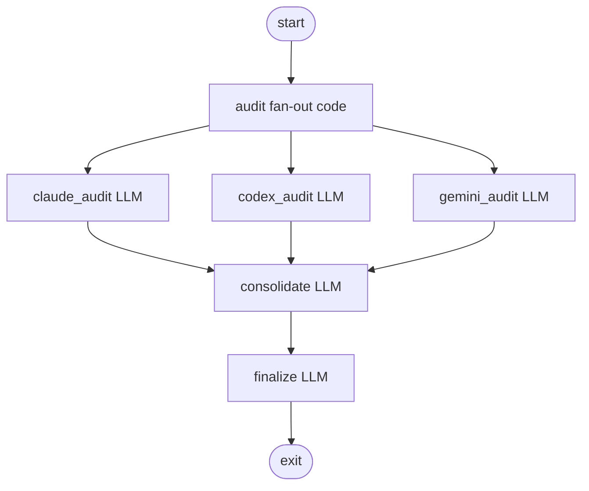

<!-- spine: spine_deterministic -->
# tgoodwin/tractor

**spine: deterministic** — binarny runner `tractor reap examples/*.dot`; observer HTTP; agent CLI jako leaf (ACP bridges).

**Confidence: 84** — tagged releases (alpha), Graphviz observer, parallel fan-out w DOT (`shape=component`).

## Co to jest

DOT pipeline runner (Elixir-ish domain w przykładach, ale orchestracja = graf). `reap` chodzi po grafie; bring-your-own agent (Claude/Codex/Gemini bridges).

## Graf (FIXED — wzorzec `parallel_audit.dot`)

## LLM vs code

| Element | Typ |
|---------|-----|
| `tractor reap` / edge routing / max_parallel | **code** |
| box + llm_provider | **LLM** leaf |
| tool_* examples (grep, git) | **code**/tool leaf |

## Linki

- https://github.com/tgoodwin/tractor
- Releases: https://github.com/tgoodwin/tractor/releases
