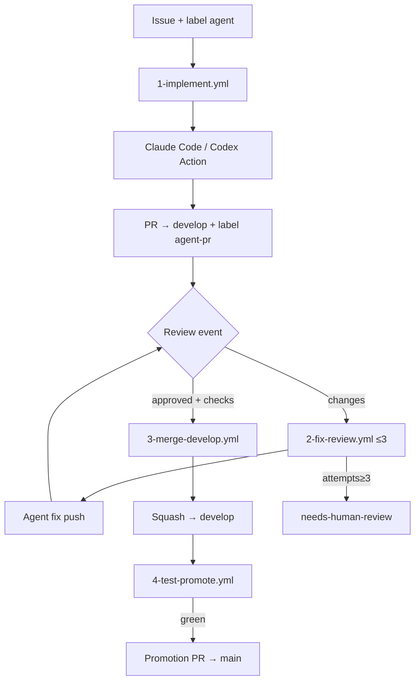

<!-- spine: spine_deterministic -->
# agent-pipeline (`TheCraigHewitt/agent-pipeline`)

**spine:deterministic** · **Confidence: 86** — czysty GHA/bash FSM: label → 1 slot agenta → review loop ≤3 → merge develop → test → promote; routing bez ReAct.

## Co to jest

Cztery workflowy kopiowane do `.github/workflows/`: implement, fix-review, merge-develop, test-promote. Konfig YAML. Agent = Claude Code Action **lub** Codex Action (jedna linia). Reviewer-agnostic (CodeRabbit/Greptile/ludzie). Orkiestracja = eventy GitHub + limity; LLM tylko w jobach implement/fix.

## Graf

## Co / gdzie / jak

| Element | Wartość |
|---------|---------|
| Stack | **Shell + GHA YAML** · MIT ★~1 |
| Trigger | Label `agent` (konfigurowalne) |
| Orkiestracja | 4 workflowy = FSM; concurrency 1/issue |
| LLM slot | Implement + bounded fix (timeout 30 min) |
| Agent-free | Merge develop, test gate, promote PR, audit comments |
| Guardrails | Cap 3, no direct push, escape hatch labels |
| Limit | Mały ★; merger nadal zależy od review tool / branch protection |

## Linki

- https://github.com/TheCraigHewitt/agent-pipeline
- Install: `scripts/install.sh` · config: `.github/agent-pipeline.yml`
- WAVE3 §6 (pure script issue→PR)
