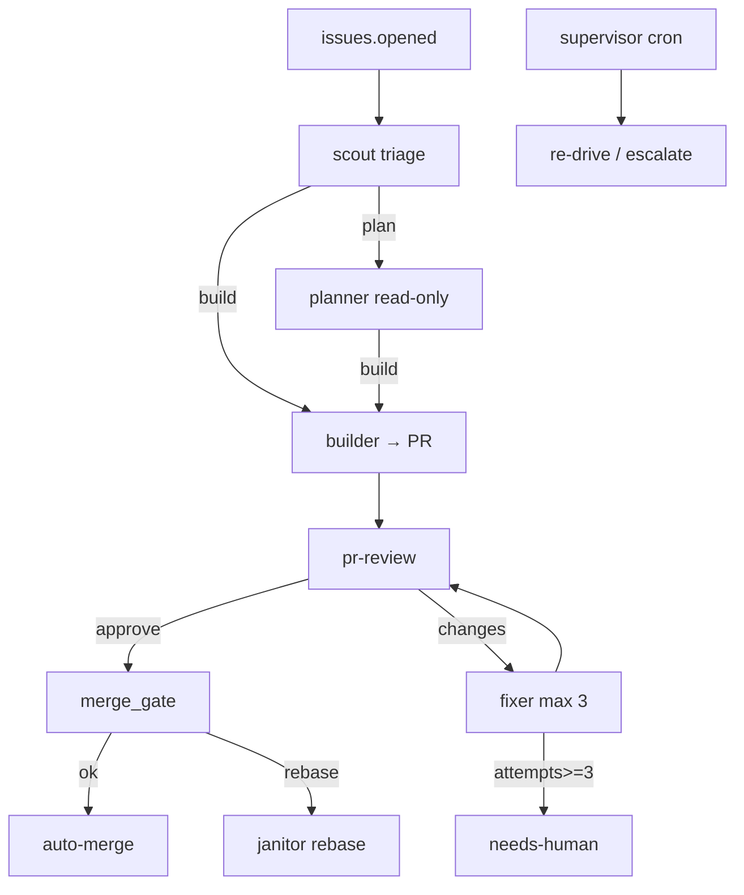

# thegpvc/gp-foundry

**Confidence: 88** — klepacz + crew w GitHub Actions; graf DOT = deterministyczny kręgosłup.

## Co to jest

Kompiluje `harness.dot` → workflowy Actions. Scout→builder→reviewer→fixer→merge_gate. Stan w labels/PR/cron.

## Graf

## Co / gdzie / jak

| Element | Wartość |
|---------|---------|
| Trigger | GitHub events + labels |
| Executor | GitHub Actions (zero własnego daemona) |
| Agent | Claude Code OAuth + AGENT_PAT |
| Merge | Policy YAML, nie persona |
| Self-heal | janitor, supervisor, retro memory |

## Linki

- https://github.com/thegpvc/gp-foundry
