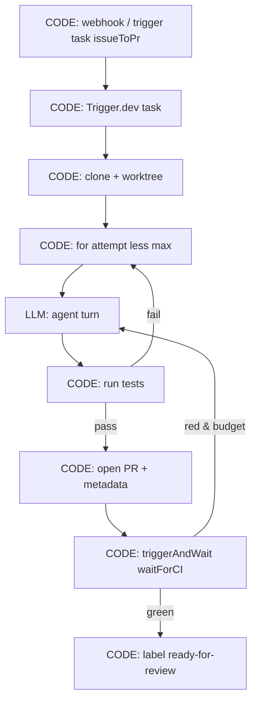

<!-- spine: spine_deterministic -->
# Trigger.dev v4 — long-running tasks jako spine

**spine:deterministic**  
**Confidence: 83** — checkpoint-resume tasks (v4 GA); linear agent loops minut–godzin bez Vercel 60s; Ty definiujesz sekwencję task/triggerAndWait — LLM w środku taska, nie jako router platformy.

## Co to jest

**Trigger.dev** = durable background tasks dla TS. Klepacz: task `issueToPr` odpala się z webhooka/labela, trzyma długi loop (implement → test → fix) na własnym workerze z checkpointami. W przeciwieństwie do Temporal **nie** wymaga replay-determinism discipline w stylu Workflow API — ale **spine nadal jest Twoim kodem** (kolejność awaitów, hard cap retries, osobny task na merge). Realtime streams → UI status bez własnego websocketu.

## Graf

## LLM vs code (węzły)

| Węzeł | Typ | Uwaga |
|-------|-----|--------|
| task definition, retries, machine size, schedules | **CODE** | Platforma = durable executor |
| setup / test / gh / CI wait | **CODE** | Zwykły async TS na workerze |
| agent turn (Claude itd.) | **LLM** | Wewnątrz taska; stream do UI |
| merge policy | **CODE** osobny task / gate | Nie mieszaj z agent turn |

## Co / gdzie / jak

| Element | Wartość |
|---------|---------|
| Trigger | HTTP / event / `tasks.trigger` / schedule |
| Spine | Trigger.dev Cloud lub Docker self-host |
| Agent leaf | Dowolny SDK w tasku; duże maszyny na ciężkie repo |
| Fit | Linear long-running agent; mniej event-choreography niż Inngest |
| Nie robi | Oddanie topologii „task graph” modelowi |

## Linki

- https://trigger.dev/docs
- https://tanayshah.dev/blog/trigger-vs-inngest-vs-temporal-agents/
- https://noqta.tn/en/blog/durable-execution-ai-agents-inngest-trigger-temporal-2026
