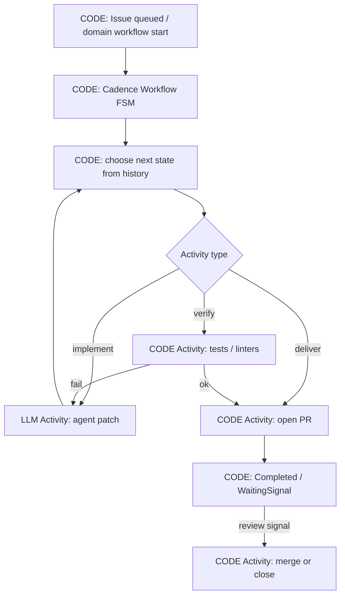

<!-- spine: spine_deterministic -->
# Uber Cadence — protoplastą Temporal (ten sam kontrakt spine)

**spine:deterministic**  
**Confidence: 82** — ten sam model Workflow/Activity co Temporal (Cadence → fork Temporal); mniej świeżych AI-harnessów, ale kontrakt determinizmu identyczny i nadal używany w orgach Uber-class.

## Co to jest

**Cadence** (Uber OSS) = durable workflow engine, z którego wyrósł Temporal. Dla klepacza issue→PR obowiązuje ta sama twarda reguła: **decyzje orkiestracji w deterministycznym Workflow**, LLM i side-effecty w Activities. Jeśli zespół ma już klaster Cadence, nie trzeba „przechodzić na agent framework” — wystarczy zawinąć coding agent jako Activity i trzymać FSM issue→PR w Workflow.

## Graf

## LLM vs code (węzły)

| Węzeł | Typ | Uwaga |
|-------|-----|--------|
| FSM stany, timers, retry policy, signals | **CODE** | Replay z historii Cadence |
| test / lint / git / GitHub API | **CODE** Activities | Idempotencja po stronie Activity |
| coding agent / review narrative | **LLM** Activities | Wynik utrwalony — Workflow nie woła modelu ponownie przy replay |
| „co dalej?” | **CODE** | Stan z wyniku Activity, nie z promptu routera |

## Co / gdzie / jak

| Element | Wartość |
|---------|---------|
| Trigger | Cadence client start + task list workers |
| Spine | Cadence server (historically Uber production) |
| Migracja | Nowe buildy → preferuj Temporal; istniejący Cadence = ten sam wzorzec spine |
| Agent leaf | Dowolny CLI/SDK w Activity (timeout + heartbeat) |
| Nie robi | Trzymanie pętli agenta tylko w RAM workera bez Workflow |

## Linki

- https://github.com/uber/cadence
- https://cadenceworkflow.io/
- Kontekst ewolucji → Temporal: https://docs.temporal.io/
- Porównanie replay vs checkpoint (2026): https://tanayshah.dev/blog/trigger-vs-inngest-vs-temporal-agents/
