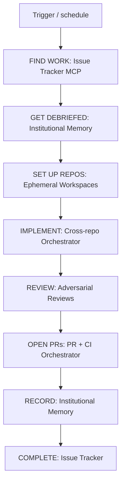

<!-- spine: spine_deterministic -->
# vsavkin — Software Factory as Workflow (DEV.to)

**Confidence: 78** — szczegółowy esej architektury na DEV.to (Victor Savkin / Nx); factory = skrypt na prymitywach; Polygraph = meta-harness (produkt), nie publiczny ticket mill OSS.

## Co to jest

Publiczna recepta klepacza: **capabilities** (Issue Tracker, Ephemeral Workspaces, Cross-repo Orchestrator, Adversarial Reviews, PR/CI Orchestrator, Institutional Memory) + cienki workflow wiring Linear + GitHub + Polygraph. Teza: factory nie jest produktem — jest workflowem.

## Graf

## Co / gdzie / jak

| Element | Wartość |
|---------|---------|
| Trigger | Osobny Trigger capability (nie jedna etykieta w eseju) |
| Workspaces | Ephemeral clones per change |
| Cross-repo | Wymagany — agent nie „pamięta” innych repo jak człowiek |
| Review | Adversarial reviews przed PR |
| CI/PR | Osobny orchestrator (Polygraph w przykładzie) |
| Memory | Institutional Memory jako źródło + sink decyzji |
| Merge | Esej skupia się na green CI / PR; polityka merge u Ciebie |
| Nie robi | Samodzielny OSS mill; L5 product discovery |

## Linki

- https://dev.to/vsavkin/a-software-factory-is-a-workflow-not-a-product-build-one-in-20-minutes-3ka1
- Canonical Medium: https://medium.com/nrwl/a-software-factory-is-a-workflow-not-a-product-build-one-in-20-minutes-7674e4135e98
- Polygraph context: https://nx.dev/blog/announcing-polygraph
