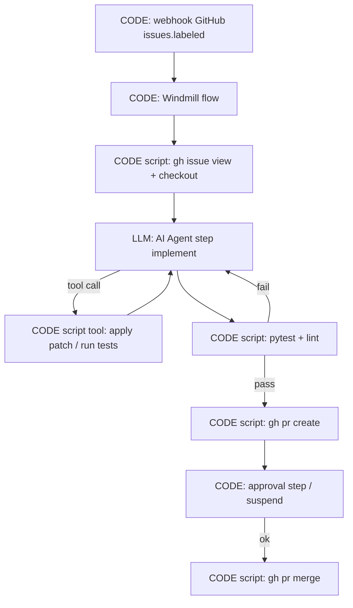

<!-- spine: spine_deterministic -->
# Windmill — flow-as-code + AI Agent step jako liść

**spine:deterministic**  
**Confidence: 80** — Windmill flows (DAG/skrypty, Postgres state, worker pool) = spine; oficjalne **AI Agent steps** to węzły LLM z toolami = skryptami Windmill; da się złożyć issue→PR bez LLM-routera.

## Co to jest

**Windmill** = self-hostowalna platforma workflow (Python/TS/Go/… → jobs). Graf flow jest **zadeklarowany** (UI lub code); stan w Postgres; retries/scheduling po stronie silnika. **AI Agent step** dodaje LLM, który może wywoływać istniejące skrypty Windmill jako tools — ale topologia (hydrate → agent → test script → open PR script → approval) zostaje w flow. Dla klepacza: trzymaj routing i bramki w krokach flow/code; oddaj modelowi tylko implement/fix.

## Graf

## LLM vs code (węzły)

| Węzeł | Typ | Uwaga |
|-------|-----|--------|
| Flow edges, schedules, approvals, error handlers | **CODE** | Silnik Windmill |
| Skrypty tool (git, test, gh) | **CODE** | Wywoływane przez agenta *lub* stałe kroki |
| AI Agent step | **LLM** | Provider OpenAI/Anthropic/…; messages + tool loop |
| Chat mode | **LLM** UI | Opcjonalne — nie używaj jako spine kolejki PR |

## Co / gdzie / jak

| Element | Wartość |
|---------|---------|
| Trigger | HTTP webhook / cron / flow schedule |
| Spine | Windmill workers + Postgres |
| Agent leaf | AI Agent step z allowlistą skryptów-tools |
| Sandbox | Izolacja jobów Windmill (per language runtime) |
| Nie robi | Oddanie całego „co dalej?” wyłącznie agentowi bez stałych kroków verify/PR |

## Linki

- https://www.windmill.dev/docs/core_concepts/ai_agents
- https://www.windmill.dev/docs/getting_started/flows_quickstart
- https://github.com/windmill-labs/windmill
