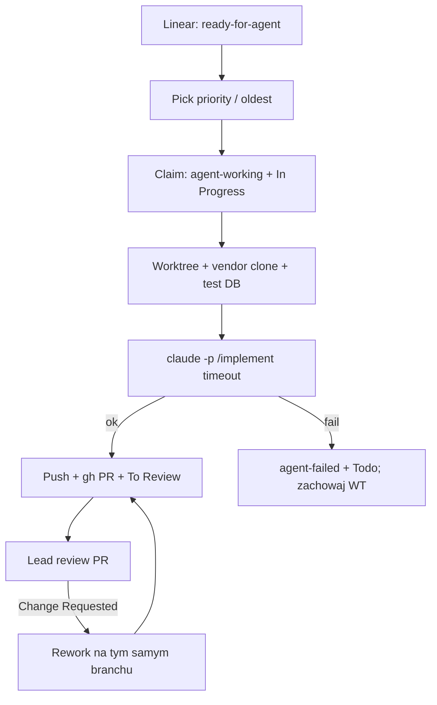

<!-- spine: spine_deterministic -->
# witify-firstmate

**Confidence: 82** — npx daemon Linear→PR: `ready-for-agent` → worktree + `claude -p /implement` → PR; harness własnie side-effecty (Linear/git/PR), LLM tylko kod.

## Co to jest

Nieobsługiwany daemon (`npx witify-firstmate`) drenujący tickety Linear z etykietą `ready-for-agent`. Per ticket: claim (`agent-working`), izolowany git worktree, `claude -p /implement` **bez dostępu do Linear**, push + PR, transfer do `To Review`. Specyficzny pod Laravel + MySQL + Witify, ale wzorzec klepacza jest czysty: label = weź, człowiek = review PR.

## Graf

## Co / gdzie / jak

| Element | Wartość |
|---------|---------|
| Stack | **Node ≥20** CLI (tsup); state `~/.witify-firstmate` + `.firstmate/` w repo |
| Install | `npx witify-firstmate start` (opcjonalnie `--detach`) |
| Trigger | Linear label `ready-for-agent` (+ stany Backlog/Todo/Change Requested) |
| Sandbox | Worktree per ticket; agent bez Linear API |
| Agent | Claude Code `/implement`; model/effort flagami |
| Testy | Laravel + per-ticket MySQL DB; scope `relevant` / `all` |
| PR mode | `per-ticket` (default) lub `per-parent` (jeden PR na epic) |
| Merge | Nigdy — PR dla człowieka; brak auto-retry po fail |
| Nie robi | Generyczny multi-stack (świadomie Laravel/Witify) |

## Linki

- npm: https://www.npmjs.com/package/witify-firstmate (v0.1.7+)
- Opis pakietu: Linear `ready-for-agent` → worktree → draft/human PR
